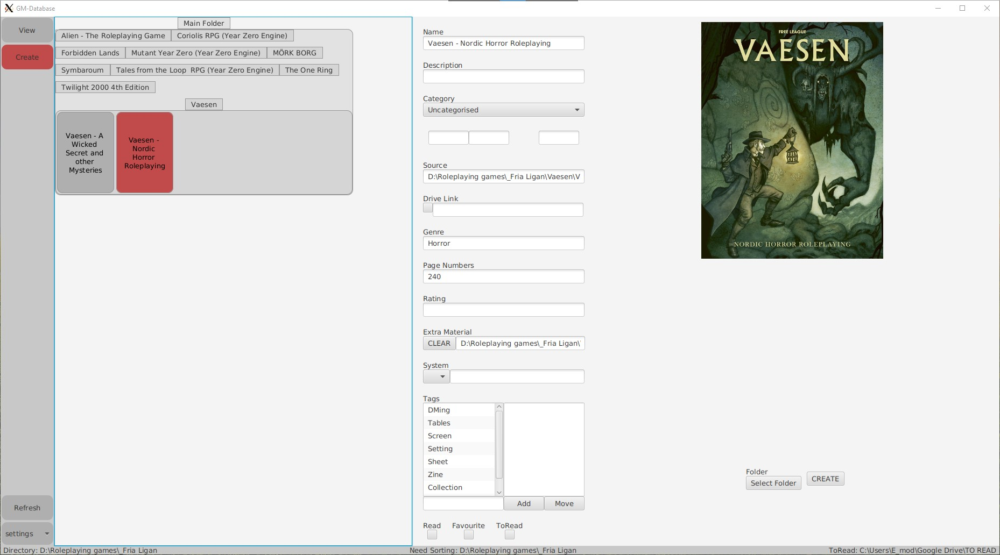
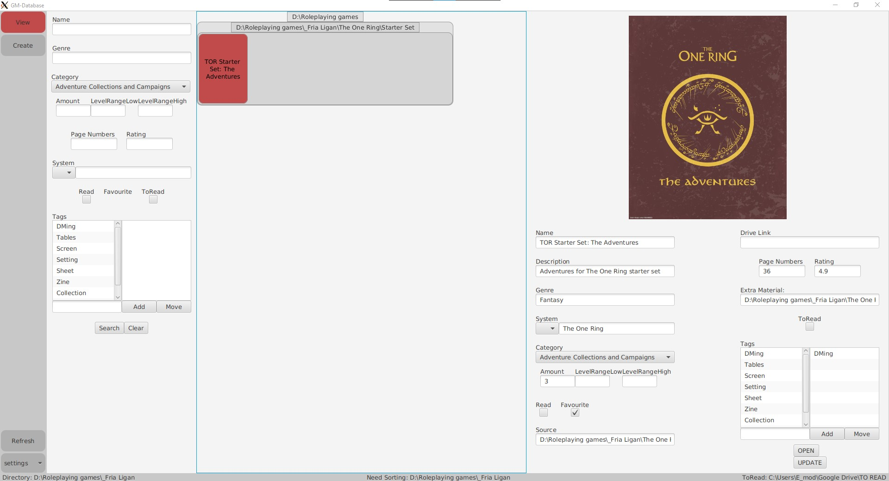

## PDF Database (abandoned)
A pdf database app that was built to be used as a native desktop application with scala, scalafx and SQLite. 

However, due to the lack of creation of an overarching architecture at the beginning of the project the codebase needs refactoring after every new feature, which was not sustainable. A new project based on this one, with the techstack scala, scalajs, laminar and tauri (and some kind of database solution) is currently being sketched out!

Examples:

Create Mode:

Creating:

View Mode:

Viewing:

Searching:
